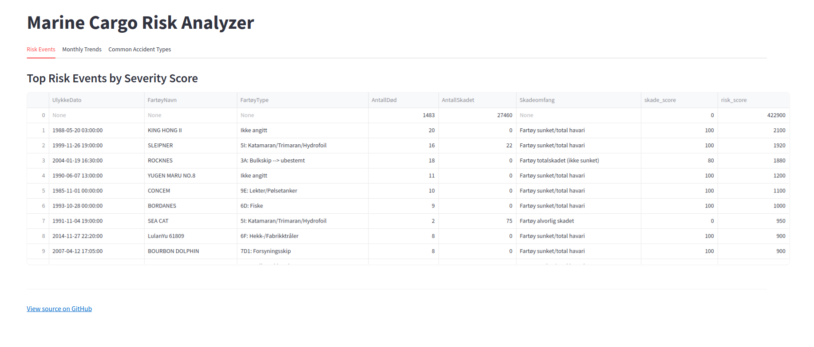
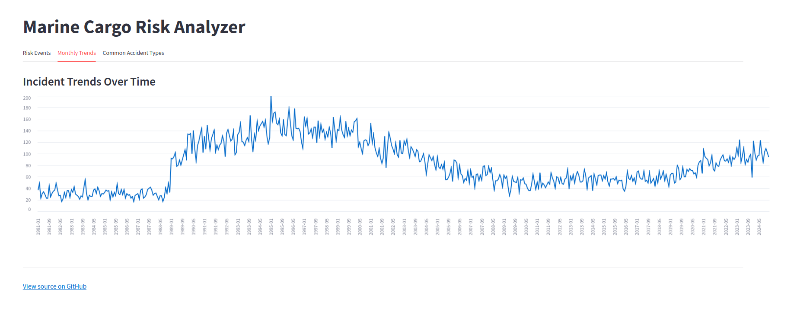

# Marine Cargo Risk Analyzer

This project analyzes real-world maritime accident data from the **Norwegian Maritime Authority** to identify high-risk events, trends, and vessel types involved in marine incidents from **1981–2024**.

**Live App**: [Streamlit Dashboard](https://marine-cargo-risk-analyzer.streamlit.app)

---

## Features

- **Risk Scoring** for each incident (fatalities, injuries, damage)
- Top incidents by severity and casualties
- Accident breakdown by ship type and accident category
- Monthly trend analysis across 40+ years
- Interactive, filterable dashboard built with **Streamlit**

---

## Project Structure

```text
/marine-cargo-risk-analyzer
├── data
│   ├── raw                      # Original Excel data from the Norwegian Maritime Authority
│   └── processed                # Cleaned CSVs and SQLite DB used in the app
├── scripts
│   ├── 01_etl.py               # Extract and transform the data
│   ├── 02_analysis.py          # Perform SQL analysis and save key outputs
│   └── streamlit_app.py        # Interactive dashboard app
├── requirements.txt            # Python dependencies
├── README.md                   # Project overview and instructions
```
---

## How to Run Locally

1. **Clone the repository**:
    ```bash
    git clone https://github.com/ChristopherIanPeck/marine-cargo-risk-analyzer.git
    cd marine-cargo-risk-analyzer
    ```

2. **Create and activate a virtual environment**:
    ```bash
    python -m venv .venv
    source .venv/bin/activate
    ```

3. **Install dependencies**:
    ```bash
    pip install -r requirements.txt
    ```

4. **Run the ETL script**:
    ```bash
    python scripts/01_etl.py
    ```

5. **Run the analysis script**:
    ```bash
    python scripts/02_analysis.py
    ```

6. **Launch the dashboard**:
    ```bash
    streamlit run scripts/streamlit_app.py
    ```
---

## Data Source

**Norwegian Maritime Authority**  
The dataset includes registered ship accidents and personal injuries from **1981–2024**, including types, consequences, and vessel metadata.  
→ [https://www.sdir.no/](https://www.sdir.no/) (data manually downloaded from NMA archive)

---

##  Screenshots



[Screenshot of Risk Dashboard](images/common_accident_types.png)

---

## License

This project is for educational and portfolio use. Attribution encouraged.

---
